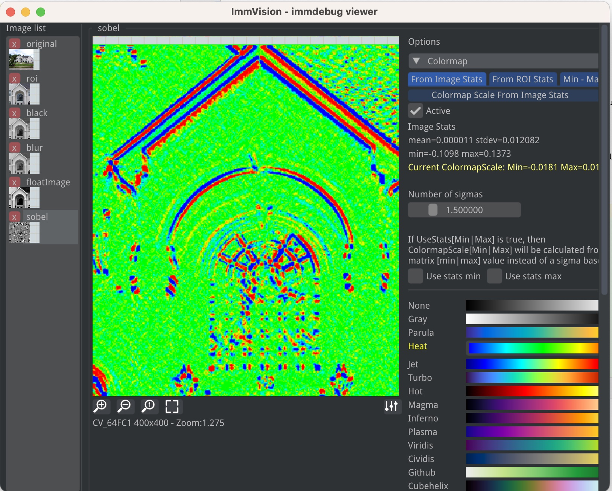

# ImmVision

ImmVision is a powerful image debugger and viewer.


## Standalone Image Debugger (during execution, *and* post-mortem)

immvision includes an advanced image debugger which you can easily plug into your C++ projects in order to be able to visually debug images inside your image processing algorithms, during execution or even *after* execution (post-mortem).

This requires **no dependency** apart from OpenCV, and you do **not** need to link your programm to immvision (you will just need to copy 4 cpp files in your project).

Let's consider an example: 
in  the following program, the image is modified in several steps, and each call to `ImmVision::ImmDebug` will add another debugged image to the debugger.

```cpp
void ExampleImageProcessingWithDebug()
{
    cv::Mat image = cv::imread(ResourcesDir() + "/house.jpg");
    ImmVision::ImmDebug(image, "original");

    cv::Mat roi = image(cv::Rect(800, 600, 400, 400));
    ImmVision::ImmDebug(roi, "roi");

    cv::Mat black;
    cv::cvtColor(roi, black, cv::COLOR_RGB2GRAY);
    ImmVision::ImmDebug(black, "black");

    cv::Mat blur;
    cv::blur(black, blur, cv::Size(5, 5));
    ImmVision::ImmDebug(blur, "blur");

    cv::Mat floatImage;
    blur.convertTo(floatImage, CV_64FC1);
    floatImage = floatImage / 255.;
    ImmVision::ImmDebug(floatImage, "floatImage");

    cv::Mat sobel;
    cv::Sobel(floatImage, sobel, CV_64F, 1, 1);
    ImmVision::ImmDebug(sobel, "sobel");
}

```

The debugger will then display:



### How to install the debugger into your program:

#### Step 1: compile immdebug_viewer

````
git clone https://github.com/pthom/immvision.git
mkdir build
cd build
cmake .. -DCMAKE_BUILD_TYPE=Release
make -j
````

Optionally, copy bin/immdebug_viewer somewhere in you PATH.

#### Step 2: add immdebug to you project

Simply drop the content of [src/immdebug](src/immdebug) somewhere into your project.

The API you will use is extremely simple:

```cpp
namespace ImmVision
{
    void ImmDebug(
        const cv::Mat & image,
        const std::string & legend = "",
        const cv::Point2d & zoomCenter = cv::Point2d(),
        double zoomRatio = -1.,
        const std::string& zoomKey = "",
        const std::string& colorAdjustmentsKey = "",
        bool isColorOrderBGR = true
    );

    void LaunchImmDebugViewer();

}
```

Step 3: Add some calls to `ImmVision::ImmDebug` in your program


`ImmVision::ImmDebug` is non blocking on the client side (all it does is to save a file in the temporary directory).

You can then run `immdebug_viewer` by calling `ImmVision::LaunchImmDebugViewer` (if you copied it into your PATH), otherwise you can launch it manually.

immdebug_viewer will display all the images that are sent to it via ImmDebug.

Features:

- Atomic application: if you re-launch `immdebug_viewer`, the global instance will come to the top. It will also come to the top as soon as you call ImmDebug.
- Debug images post-mortem: the images are written inside `%temp_directory%/ImmDebug"`. You can launch immdebug_viewer later, they will still be available.
- Auto clean of the temp folder: images are cleaned automatically after 1 hour.


## Image Viewer

This image viewer runs inside [ImGui](https://github.com/ocornut/imgui) (and thus your program must be linked to it).

This viewer is also included inside [ImGui Bundle](https://github.com/pthom/imgui_bundle), where it can also be used from python.

The API can be summarized as 
```
IMMVISION_API void Image(const std::string& label, const cv::Mat& mat, ImageParams* params);
```

See [Full API](src/immvision/image.h)


See [online demo!](https://traineq.org/ImGuiBundle/emscripten/bin/demo_immvision_launcher.html)


